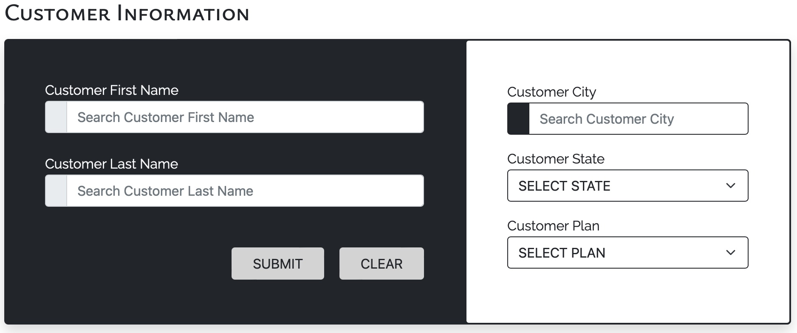
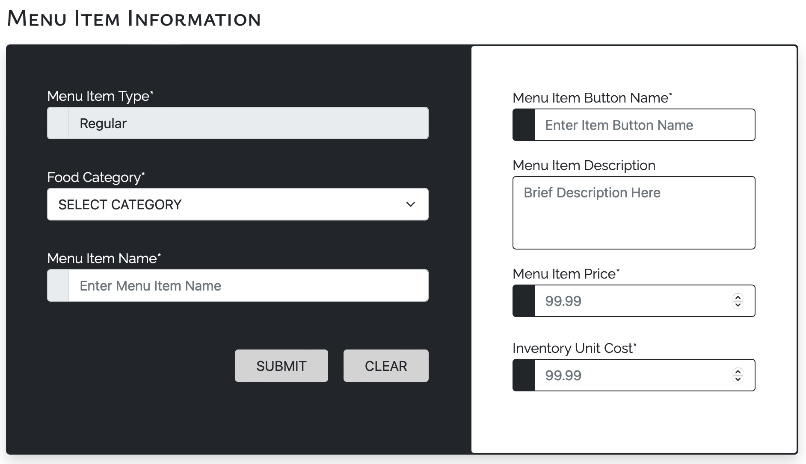
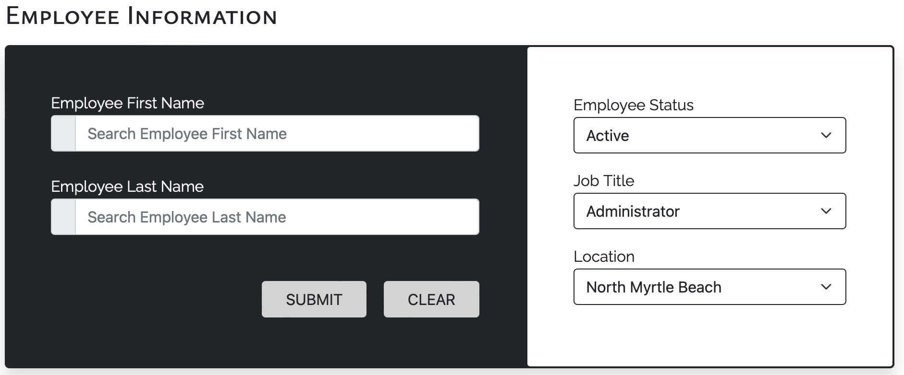
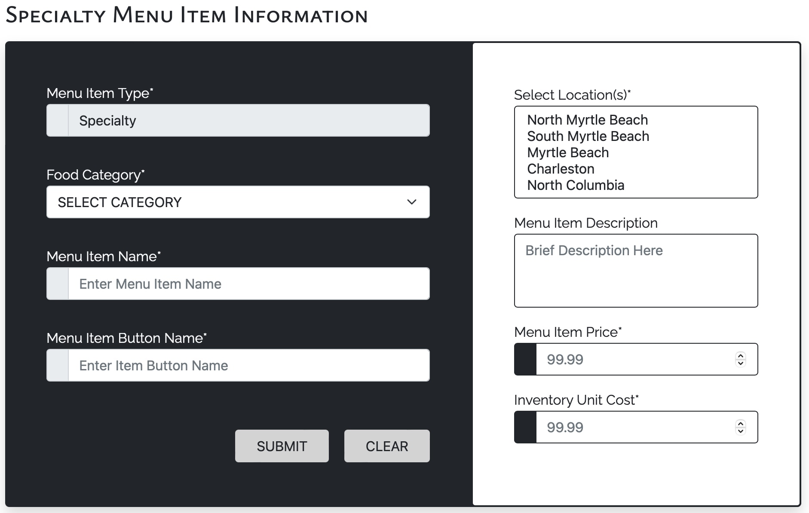
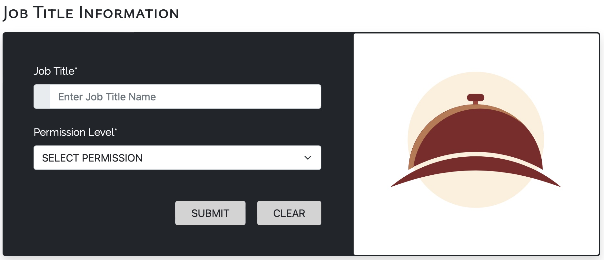
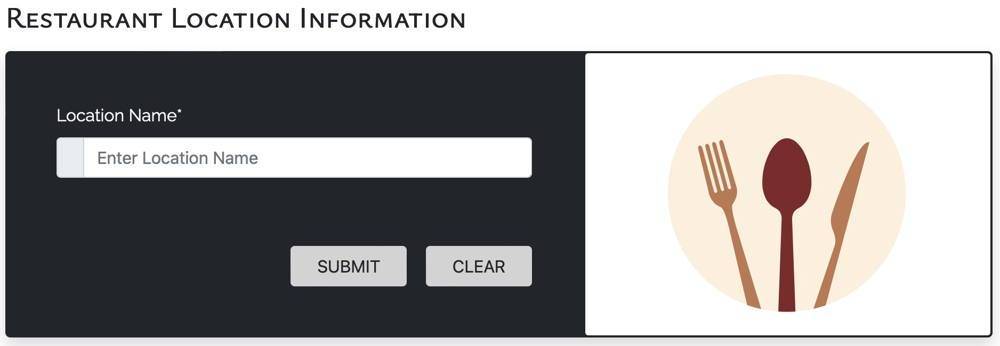
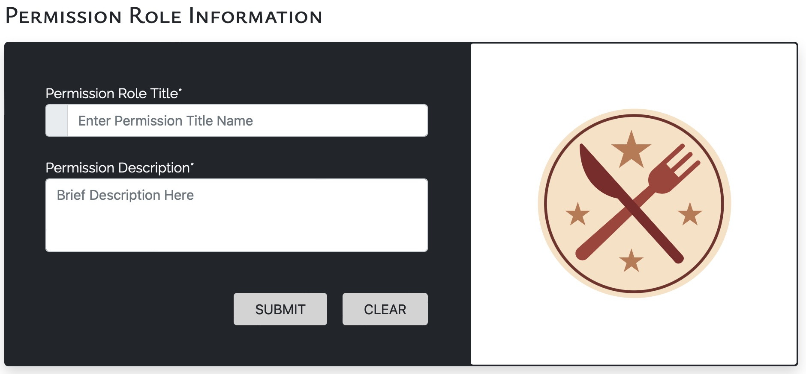
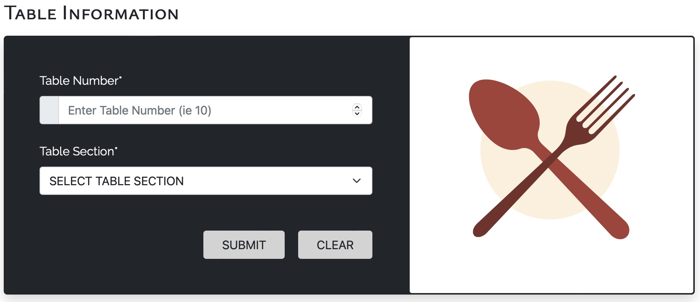

# Vittles Restaurant Group Point-of-Sale System

## Description

A fully-functional point-of-sale-system created for the *Vittles Restaurant Group*. This web application was designed with the employee in mind, ranging from the hourly, to the salaried management position. The system allows users to log in with their unique credentials, create customer order transactions, manage inventory levels, track menu item details, and edit employee information. 
<!--The front-end environment was established utilizing the Bootstrap architecture module, while the back-end took advantage of the LAMP stack structure. The web environment consists of a streamlined aesthetic, while incorporating a simple, yet effective, color palette. -->
> Click here for [Video Demo](https://www.loom.com/share/fbf197d4fa9a4a728485856623861eb3?sid=bab0854c-5b9b-44b9-b749-d977d2704234).

## Technical Specifications
### Programming Languages | Environments

* HTML
* CSS
* Bootstrap
* PHP
* SQL
* LAMP

## Program Walkthrough: A Brief Summary
### Screenshots
*User will first log into the Vittles POS system by entering their unique credentials and then choose the appropriate job position.*  
<!---->
&nbsp;&nbsp;
 

*Once credentials have been validated, the user will be able to perform a number of operations, dependent upon permission level.*  
&nbsp;&nbsp;&nbsp;&nbsp;&nbsp;&nbsp;
  
&nbsp;&nbsp;&nbsp;&nbsp;&nbsp;&nbsp; 
*The operations that will be permitted include:* 
* Add | Edit Customer Data
* Add | Edit Employee Data
* Managing Menu Item & Product Data
* Add | Edit Location Data
* Tracking Item Inventory
* Placing Customer Orders

